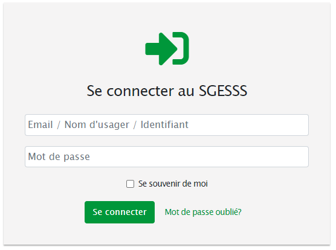
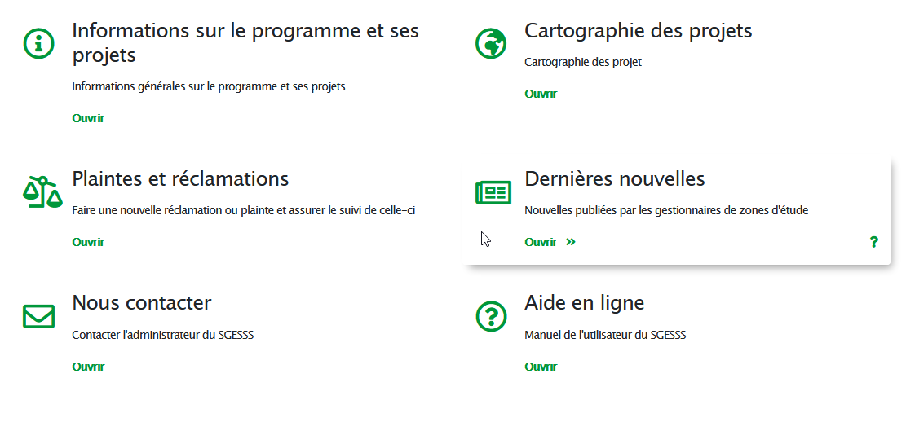

# Se connecter à la plateforme

| Colonne 1         | Colonne 2     | Colonne 3  |
| ----------------- |:-------------:| ----------:|
| gauche            | centrée       | $1600      |
| lorem             | ipsum         | $12        |
| lorem             | ipsum         |  $1        |

# Autre titre

> Quote

Here's a line for us to start with.

This line is separated from the one above by two newlines, so it will be a *separate paragraph*.

This line is also a separate paragraph, but...
This line is only separated by a single newline, so it's a separate line in the *same paragraph*.

Modif

---

# Troisième titre

> Blockquotes are very handy in email to emulate reply text.
> This line is part of the same quote.

Quote break2.

> This is a very long line that will still be quoted properly when it wraps. Oh boy let's keep writing to make sure this is long enough to actually wrap for everyone. Oh, you can *put* **Markdown** into a blockquote.