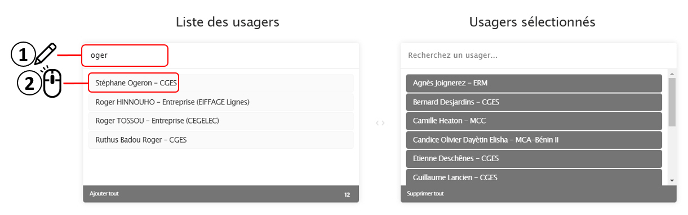

La thématique **Santé sécurité** regroupe les modules suivants :

# Module Déclaration d'accidents

Le module déclaration d'accidents est composé de plusieurs sous-modules qui permettent de :  
- faire une **déclaration** préliminaire d'accident; 
- consulter le **registre** des accidents. Cela permet aussi de compléter la déclaration préliminaire avec :
  - les informations complémentaires; 
  - la déclaration aux autorités sanitaires et à la médecine du travail;
  - le suivi, les enquêtes, les analyses et les mesures de prévention.
- consulter les **statistiques** relatives aux déclarations d'accidents.
- consulter et mettre à jour la liste des **personnes à aviser** en cas d'accident.
- consulter et mettre à jour les **paramètres** du module

Pour accéder à un de ces sous-modules, cliquez sur ***Ouvrir*** situé sous l'icône et la description sommaire.

## Faire une déclaration

Pour faire une déclaration d'accident, vous devez remplir <ins>tous les champs du formulaire.</ins>

1) Sélectionnez dans la liste déroulante le niveau de **gravité de l'accident** :

2) Sélectionnez la **date** et l'**heure** de l'accident

3) Cliquez sur le bouton  pour saisir les informations sur la **victime** de l'accident. Une fenêtre modale apparaitra.

4) Saisissez le **nom** de la victime. Si la victime est un usager de la plateforme, son nom va apparaitre. A ce moment, vous pouvez le sélectionner sinon il faut l'écrire au complet. 

Si vous avez fait une erreur, vous pouvez recommencer en cliquant sur le x à droite du nom.

5) Sélectionnez le **sexe** de la victime

6) Sélectionnez la **nature des lésions** dans la liste déroulante. Vous pouvez en sélectionner plusieurs.

Il est possible d'en supprimer en cliquant sur le x à gauche du nom.

7) Sélectionnez le **siège des lésions** dans la liste déroulante. Vous pouvez en sélectionner plusieurs. 

Il est possible d'en supprimer en cliquant sur le x à gauche du nom.

Lorsque vous avez complété toutes les informations de cette fenêtre modale, cliquez sur le bouton ***Enregistrer***. Vous pouvez ajouter une autre victime du même accident en recommençant la même procédure.

8) Décidez si vous souhaitez ajouter un ou plusieurs **témoins**. Dans l'affirmative, commencez à saisir le nom du premier témoin. Si le témoin est un usager de la plateforme, son nom va apparaitre. A ce moment, vous pouvez le sélectionner sinon il faut l'écrire au complet. Vous pouvez ajouter plusieurs témoins. 

Il est possible d'en supprimer en cliquant sur le x à gauche du nom.

9) Saisissez la **localisation exacte de l'accident** en écrivant le nom de la rue, du carrefour, en face de tel magasin, etc. Soyez le plus précis possible.

10) Saisissez la **description de l'accident**. Soyez le plus détaillé possible.

11) Vous pouvez ajouter une ou plusieurs **photos de l'accident**

12) Enfin indiquez la **localisation de l'accident** sur la carte. Par défaut, la carte localise l’endroit où vous êtes au moment de faire la déclaration. Attention : c’est la position de l’accident qu’il faut indiquer. Il est possible de se déplacer sur la carte en gardant le clic gauche enfoncé et en déplaçant la souris. Il est possible de zoomer avec la règle à gauche ou en utilisant la molette de la souris. 

13) Lorsque vous avez complété le formulaire de déclaration d'accident, cliquez sur 

La déclaration de l'accident est enregistrée dans la plateforme et les personnes responsables de la santé-sécurité sont avisées automatiquement.

## Registre des accidents

Le registre des accidents permet de consulter les déclarations d'accident et d'assurer leur gestion et leur suivi.

### Explorer le registre

Par défaut, le registre se présente sous la forme d'un tableau qui contient les informations suivantes (colonnes) :
- Code de l'accident : code unique généré automatiquement par la plateforme
- Gravité de l'accident
- Accident avec ou sans arrêt de travail
- Nombre de jours d'arrêt de travail
- Personne qui a déclaré l'accident
- Date et heure de l'accident
- Nature des lésions
- Siège des lésions
- Actions

Le nombre d'éléments (accidents) affichés et le nombre total d'éléments est indiqué en bas à gauche du tableau

Vous pouvez passer d'une page à l'autre en cliquant sur les boutons en bas à droite du tableau

image à venir

Vous pouvez trier les colonnes en cliquant dans l'en-tête

image à venir

Vous pouvez ajuster le nombre d'éléments (accidents) qui s'affichent sur une page

image à venir

Vous pouvez rechercher des éléments (accidents) spécifiques en saisissant les informations pertinentes dans la boite de dialogue ***Rechercher***

image à venir

Vous pouvez exporter le registre en format Excel (xlsx) en cliquant sur le bouton ***Exporter le registre*** situé en haut à gauche du tableau. Le registre exporté contient les informations suivantes (colonnes) :
- Code de l'accident : code unique généré automatiquement par la plateforme
- Date et heure de l'accident
- Personne qui a déclaré l'accident
- Organisation du déclarant
- Nom de la (des) victimes(s)
- Accident avec ou sans arrêt de travail
- Nombre de jours d'arrêt de travail
- Nature des lésions
- Siège des lésions
- Description de l'accident

### Traitement des accidents

L'ensemble des paramètres pour la gestion et le suivi des déclarations d'accidents sont dans la colonne Actions du tableau.

## Statistiques

Le sous-module **statistiques** présente les statistiques relatives au nombre d'accidents déclarés en fonction de leur catégorie :
* en cours d'enquête
* avec arrêt de travail
* sans arrêt de travail
* total

## Personnes à aviser

> :warning: **Attention** ce sous-module est réservé aux usagers avec des droits d'administrateur.

Ce sous-module permet de gérer la liste des personnes à aviser en cas de nouvelle déclaration d'accident. Ces personnes doivent être des usagers enregistrés de la plateforme. Pour rechercher le nom de la personne, commencez à l'écrire en haut de la colonne de gauche. Quand le nom apparait dans la liste, cliquez dessus. Il s'ajoutera automatiquement à la colonne de droite.

Pour supprimer le nom d'une personne sélectionnée (colonne de droite), il suffit de cliquer sur son nom.

Lorsque c'est terminé, cliquez sur le bouton ***Valider***

## Paramètres

> :warning: **Attention** ce sous-module est réservé aux usagers avec des droits d'administrateur.

Précisez la durée (en heures) au bout de laquelle la phase d'enquête d'une déclaration d'accident doit être complétée.

Lorsque c'est terminé, cliquez sur le bouton ***Enregistrer***

# Module Déclaration des maladies infectieuses

Le module déclaration des maladies infectieuses est composé de plusieurs sous-modules qui permettent de :  
- faire un enregistrement de maladie infectieuse au sein d'une organisation
  - nombre de personnes testées
  - nombre de cas positifs/négatifs
- consulter les registres des enregistrements des maladies infectieuses
- faire une déclaration de maladie infectieuse
  - Nom de la maladie
  - Gravité des symptômes
  - Personnes exposées
  - Localisation
- consulter le registre des déclarations des maladies infectieuses
- consulter et mettre à jour la liste des personnes à aviser en cas de maladie infectieuse.
- consulter et mettre à jour les paramètres du module

# Module Autorisations de travail

Le module déclaration des maladies infectieuses permet de :  
- ajouter une autorisation de travail au registre
- consulter le registre des autorisations de travail
